# 🤟 Signéo - Learn ASL Fingerspelling with AI

<div align="center">

**Break down communication barriers with real-time sign language recognition**

[](https://parle-avec-tes-mains.fr)
[](https://www.python.org/)
[](https://www.djangoproject.com/)
[](LICENSE)

[Features](#-why-signéo) • [Demo](#-see-it-in-action) • [Tech Stack](#-tech-stack) • [Quick Start](#-quick-start) • [Roadmap](#-whats-next)

</div>

---

## 🎯 Why Signéo?

**Signéo transforms how people learn American Sign Language fingerspelling.** Using cutting-edge computer vision and machine learning, it provides instant feedback as you practice ASL letters through your webcam.

### 💡 The Problem
- **70 million** deaf people worldwide struggle with communication barriers
- Learning sign language is time-consuming and requires expensive tutors
- No instant feedback when practicing alone
- Limited accessibility to quality learning resources

### ✨ The Solution
**Signéo makes ASL learning:**
- ⚡ **Instant** - Real-time recognition with <100ms latency
- 🎯 **Accurate** - 95%+ recognition accuracy across lighting conditions
- 🆓 **Free** - No subscriptions, no paywalls, completely open-source
- 🔒 **Private** - Zero data collection, everything runs locally
- 📱 **Accessible** - Works on any device with a camera

## 🚀 See It in Action

<div align="center">

### [👉 Try Live Demo](https://parle-avec-tes-mains.fr)

</div>

### How It Works in 3 Steps:

```mermaid
graph LR
    A[📷 Open Camera] --> B[🤚 Sign Letter]
    B --> C[✅ Instant Recognition]
    C --> D[📝 Build Words]
```



1. **Grant camera access** - One click to start
2. **Sign ASL letters** - Follow the visual guide
3. **Get instant feedback** - See predictions in real-time
4. **Build words** - Confirm letters to compose words

## 🎨 Key Features

| Feature | Description |
|---------|-------------|
| 🎥 **Real-time Recognition** | Instant ASL fingerspelling detection with MediaPipe hand tracking |
| 📚 **Interactive Alphabet** | Visual reference guide for all 26 ASL letters |
| 🔤 **Word Builder** | Compose complete words letter by letter |
| ♿ **WCAG Compliant** | Full keyboard navigation and screen reader support |
| 📱 **Responsive Design** | Seamless experience on desktop, tablet, and mobile |
| 🔐 **Privacy First** | No data storage, no tracking, no cookies |

## 🛠️ Tech Stack

### Backend Powerhouse
```python
Django 4.0+          # Robust web framework
MediaPipe            # Google's hand landmark detection
OpenCV               # Computer vision processing
Scikit-learn         # ML model training & inference
Random Forest        # Optimized classifier (95%+ accuracy)
```

### Frontend Excellence
```javascript
Vanilla JS           # Zero dependencies, maximum performance
WebRTC               # Browser-based camera access
CSS3                 # Modern, accessible design
```

### ML Model Specs
- **Input**: 21 hand landmarks (x, y, z coordinates)
- **Architecture**: Random Forest with 87 advanced features
- **Training**: 10,000+ images across 26 ASL letters
- **Accuracy**: >95% on test dataset
- **Inference**: <50ms per prediction

## ⚡ Quick Start

### Prerequisites
```bash
Python 3.8+
pip
virtualenv (recommended)
```

### Installation (5 minutes)

```bash
# Clone the repository
git clone https://github.com/yourusername/signeo.git
cd signeo/asl_monolith

# Create virtual environment
python -m venv venv
source venv/bin/activate  # On Windows: venv\Scripts\activate

# Install dependencies
pip install -r requirements.txt

# Setup environment
cp .env.example .env
# Edit .env with your SECRET_KEY

# Run migrations
python manage.py migrate

# Start server
python manage.py runserver
```

### Access the App
```
🌐 http://localhost:8000
```

### Environment Configuration

```env
SECRET_KEY=your-django-secret-key-here
DEBUG=False
DEFAULT_THEME=modern
```

## 📸 Screenshots

<div align="center">

### Homepage - Clean & Intuitive


### Live Recognition - Real-time Feedback


</div>

## 🎯 Use Cases

### 👨‍🎓 For Learners
- Practice ASL alphabet at your own pace
- Get instant feedback without a tutor
- Track your progress as you build words

### 👨‍🏫 For Educators
- Free tool for classroom demonstrations
- Engage students with interactive learning
- Supplement traditional ASL curriculum

### 👨‍💻 For Developers
- Learn computer vision and ML implementation
- Contribute to accessibility technology
- Build upon open-source foundation

### 🏥 For Healthcare
- Bridge communication gaps in medical settings
- Train staff on basic ASL communication
- Improve patient care for deaf community

## 🔮 What's Next?

### Roadmap 2024-2025

- [ ] **LSF Support** - French Sign Language integration
- [ ] **Mobile Apps** - Native iOS & Android applications
- [ ] **Learning Modules** - Structured lessons with progress tracking
- [ ] **Multiplayer Mode** - Practice with friends in real-time
- [ ] **Full ASL Vocabulary** - Beyond fingerspelling to complete signs
- [ ] **Gamification** - Achievements, leaderboards, challenges
- [ ] **API Access** - Integrate recognition into your apps

## 📊 Impact & Stats

<div align="center">

| Metric | Value |
|--------|-------|
| 🌍 **Potential Users** | 70M+ deaf people worldwide |
| ⚡ **Recognition Speed** | <100ms latency |
| 🎯 **Accuracy** | 95%+ across conditions |
| 💰 **Cost** | $0 - Completely free |
| 🔒 **Data Collected** | 0 bytes - Privacy first |

</div>

## 🤝 Contributing

We welcome contributions! Here's how you can help:

1. 🐛 **Report bugs** - Open an issue
2. 💡 **Suggest features** - Share your ideas
3. 🔧 **Submit PRs** - Improve the code
4. 📖 **Improve docs** - Help others understand
5. 🌍 **Translate** - Make it accessible globally

### Development Setup
```bash
# Fork the repo, then:
git clone https://github.com/YOUR_USERNAME/signeo.git
cd signeo
git checkout -b feature/your-feature-name

# Make changes, test, commit
git commit -m "Add: your feature description"
git push origin feature/your-feature-name

# Open a Pull Request
```

## 🔐 Security & Privacy

- ✅ No data collection or storage
- ✅ No user tracking or analytics
- ✅ No cookies or third-party scripts
- ✅ All processing happens locally
- ✅ Sensitive files protected via `.gitignore`

**Protected files:**
- `.env` - Secret keys
- `*.p` - ML models (large files)
- `db.sqlite3` - Database

## 📄 License

MIT License - feel free to use this project for learning, teaching, or building upon.

## 💬 Get in Touch

<div align="center">

### Let's Build Something Amazing Together

[](mailto:maximemartin510@gmail.com)
[](https://www.linkedin.com/in/maxime-martin-090731aa/)

</div>

### 👨‍💻 For Developers
Interested in the ML model or want to contribute? Reach out for technical documentation and collaboration opportunities.

### 🎓 For Educators & Researchers
Looking to integrate this into educational programs or research? Let's discuss partnerships.

### 🤟 For the Deaf Community
Your feedback shapes this project. Share your insights to make Signéo more effective and inclusive.

---

<div align="center">

**Signéo** - Breaking barriers, one sign at a time 🤟

⭐ Star this repo if you find it helpful!

[Live Demo](https://parle-avec-tes-mains.fr) • [Report Bug](https://github.com/yourusername/signeo/issues) • [Request Feature](https://github.com/yourusername/signeo/issues)

</div>
